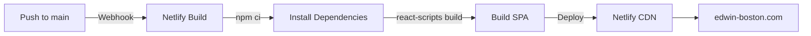

# Project Audit: fullstack-portfolio

**Audit Date**: February 18, 2026  
**Project**: Edwin's Portfolio Website (React SPA with Serverless Backend)  
**Live Site**: [edwin-boston.com](https://edwin-boston.com)

---

## Current Stack

### React & Build Tooling
- **React Version**: `18.3.1` (Latest stable)
- **React Scripts Version**: `5.0.1` (Create React App v5)
- **Module Bundler**: Webpack (via react-scripts)

### Major UI & Utilities Dependencies
| Package | Version | Purpose |
|---------|---------|---------|
| `react-router-dom` | `6.30.3` | Client-side routing (4 main routes) |
| `framer-motion` | `11.14.4` | Page transition animations & motion effects |
| `styled-components` | `6.1.13` | CSS-in-JS for component-scoped styling |
| `three` | `0.169.0` | 3D graphics library |
| `@react-three/fiber` | `8.18.0` | React renderer for Three.js |
| `@react-three/drei` | `9.122.0` | Utility components for React Three Fiber |
| `@fortawesome/react-fontawesome` | `3.1.0` | FontAwesome icons (v7.x) |
| `react-icons` | `5.4.0` | Alternative icon library (Hero Icons, Bootstrap, etc.) |
| `axios` | `1.13.5` | HTTP client for API requests (contact form) |
| `react-swipeable` | `7.0.2` | Touch swipe gestures for mobile |

### Development Dependencies
- `@babel/plugin-proposal-private-property-in-object` - Babel plugin for class private properties
- `resolve-url-loader` - Webpack loader for resolving URL paths in CSS
- **Overrides**:
  - `postcss@8.4.31` - Pinned to address vulnerabilities
  - `nth-check@2.0.1` - Security patch

### Language & Tooling
- **Language**: Plain **JavaScript** (ES6+, no TypeScript)
- **Node.js Version**: 
  - **Local Dev**: `v24.11.1`
  - **CI/CD (Netlify)**: `20` (as per `netlify.toml`)
- **npm Version**: 
  - **Local Dev**: `11.6.2`
  - **CI/CD (Netlify)**: `10` (as per `netlify.toml`)

### Browser Support
**Production** (from `browserslist`):
```
>0.2% market share
not dead
not op_mini all
```

**Development** (from `browserslist`):
```
last 1 chrome version
last 1 firefox version
last 1 safari version
```

---

## Project Structure

### Architecture Type
- **Single Frontend App** (not a monorepo)
- **Root Package**: Contains convenience build scripts that delegate to `/frontend`
- **Actual App**: Located in `/frontend` with its own `package.json`

### Monorepo Management
- **Not a monorepo** - No Turborepo, Nx, or Yarn workspaces
- **Manual folder organization**:
  - `/frontend` - React SPA
  - `/backend/archive/mongodb-backend` - Legacy Node.js + MongoDB (archived, not used)
  - Root-level `package.json` with wrapper scripts

### Backend Architecture
**Active Backend**: AWS Lambda + DynamoDB (Serverless)
- Handles contact form submissions
- Not part of this repository (deployed separately to AWS)

**Legacy Backend** (archived):
- Express.js + MongoDB integration
- Located in `/backend/archive/mongodb-backend/`
- Includes Jest tests for MongoDB CRUD operations
- **Status**: Preserved for reference only; no longer active

### Frontend Routes & Pages
The app implements 4 main routes using `react-router-dom` v6:

| Route | Component | Purpose |
|-------|-----------|---------|
| `/` | `HomePage` | Landing page with hero section |
| `/about` | `AboutMe` | About me / skills showcase |
| `/projects` | `ProjectPage` | Portfolio projects grid |
| `/contact` | `ContactPage` | Contact form (integrates with AWS Lambda) |

All routes use **lazy loading** with `React.lazy()` and a `<Suspense>` fallback showing a loader component.

### Number of Pages/Routes
- **4 main routes** as listed above
- Simple, focused structure (no nested routes)
- All pages mounted under BrowserRouter in `App.js`

### CRA-Specific Features Used
✅ **Yes, using**:
- **Standard `public/index.html`**: Default CRA setup with minimal customization
  ```html
  <div id="root"></div>
  ```
- **Public folder serving**: Images in `public/images/` are automatically accessible
- **Lazy code splitting**: Using `React.lazy()` for route-based code splitting
- **CSS loaders**: CRA's built-in CSS/SCSS/styled-components support

❌ **Not using**:
- **REACT_APP_* Environment Variables**: No `.env` file with `REACT_APP_` prefix found
- **Proxy configuration**: No CRA proxy for API calls (using axios directly to external APIs)
- **Eject**: Project has not been ejected; still using `react-scripts start/build`

### File Structure
```
frontend/
├── public/
│   ├── _redirects          (Netlify routing config)
│   ├── index.html          (CRA default, minimal customization)
│   ├── manifest.json       (PWA metadata)
│   └── images/             (Static assets)
├── src/
│   ├── App.js              (Root component, routing setup)
│   ├── index.js            (React DOM entry point)
│   ├── index.css           (Global styles)
│   ├── assets/
│   │   └── images/         (Local image assets)
│   ├── bootstrap/          (Bootstrap CSS framework - bundled)
│   ├── components/         (6 route + layout components)
│   │   ├── AboutMe.{js,css}
│   │   ├── ContactPage.{js,css}
│   │   ├── Header.{js,css}
│   │   ├── HomePage.{js,css}
│   │   ├── Loader.{js,css}
│   │   └── ProjectPage.{js,css}
│   └── styles/
│       └── globalStyles.js (styled-components global styles)
└── package.json            (React 18.3.1, react-scripts 5.0.1)
```

---

## Build & Deployment

### Deployment Platform
- **Host**: **Netlify**
- **Live URL**: https://edwin-boston.com
- **Build Command**: `npm ci && npm run build`
- **Publish Directory**: `build/`
- **Build Environment** (from `netlify.toml`):
  - Base directory: `frontend`
  - Node.js: `20`
  - npm: `10`

### Build & Deploy Pipeline



**Configuration**: [netlify.toml](netlify.toml)
```toml
[build]
  base = "frontend"
  command = "npm ci && npm run build"
  publish = "build"

[build.environment]
  NODE_VERSION = "20"
  NPM_VERSION = "10"
```

### CI/CD Setup
- **GitHub Actions Workflows**: **None configured** (Netlify auto-deploys on push)
- **Dependency Management**: Configured Dependabot for weekly npm updates
  - Location: [.github/dependabot.yml](.github/dependabot.yml)
  - Ignored packages: `webpack-dev-server@4.15.x` (dev-only dependencies)

### Custom Build Configurations
- **Eject Status**: ❌ **Not ejected** - Using standard `react-scripts`
- **craco**: ❌ Not used
- **Custom Webpack Config**: ❌ Not used
- **react-app-rewired**: ❌ Not used
- **Post-CSS Plugins**: Just standard CRA defaults
- **SCSS/SASS Loader**: Bootstrap CSS included via CDN-style bundling

### Build Output & Optimization
- **Bundle Analysis**: Not configured (using CRA defaults)
- **Code Splitting**: ✅ Route-based using `React.lazy()`
- **Asset Optimization**: Handled by CRA's webpack config
- **Minification**: Automatic via `react-scripts build`

---

## Testing

### Testing Framework & Setup

**Status**: ⚠️ **Minimal testing infrastructure**

The project has Jest available but **not actively configured for the frontend**:
- Jest is installed (via `react-scripts`)
- Legacy Node.js backend in `/backend/archive/mongodb-backend/` has Jest configured
  - File: [/backend/archive/mongodb-backend/jest.config.js](/backend/archive/mongodb-backend/jest.config.js)
  - Tests were for MongoDB CRUD operations (no longer active)

### Frontend Testing
| Framework | Status | Notes |
|-----------|--------|-------|
| **Jest** | ✅ Available | Via `react-scripts` (not configured for specific tests) |
| **React Testing Library** | ❌ Not installed | No component unit tests |
| **Cypress / Playwright** | ❌ Not installed | No E2E tests |
| **Mock Service Worker** | ❌ Not installed | No API mocking |

### Current Test Coverage
- **Frontend Components**: 0% (no test files in `src/`)
- **Backend (Legacy)**: Archived; not maintained
- **E2E**: None

### Running Tests
```bash
# Available but no tests currently configured
npm test
```

This runs `react-scripts test` in watch mode, ready for CRA to auto-detect test files (`.test.js`, `.spec.js`).

### Recommended Testing Additions (Future)
If you want to add testing:
1. **Unit Tests**: React Testing Library + Jest
2. **E2E Tests**: Cypress or Playwright
3. **Coverage**: `npm test -- --coverage`

---

## Security & Maintenance

### Recent Security Updates
✅ **Status**: All critical vulnerabilities resolved (as of 2025-11-20 cleanup)
- Fixed `js-yaml` prototype pollution vulnerability (GHSA-mh29-5h37-fv8m)
- Removed deprecated `emailjs-com` package
- Pinned `postcss` and `nth-check` for known vulnerabilities
- Noted: `webpack-dev-server@4.15.2` dev-only vulnerabilities are acceptable trade-off for CRA v5 stability

### Dependency Management
- **Strategy**: Dependabot weekly updates (NPM ecosystem)
- **Overrides**: Used for critical patch pinning
- **Node Version Mismatch**: Local (24.11.1) vs Netlify (20) — handled gracefully by npm

---

## Summary Table

| Category | Detail |
|----------|--------|
| **App Type** | Single-Page Application (React 18.3.1) |
| **Routing** | react-router-dom v6 (4 routes) |
| **Styling** | styled-components + Bootstrap CSS + custom CSS |
| **Animations** | framer-motion for page transitions |
| **3D Graphics** | Three.js + React Three Fiber |
| **Backend** | AWS Lambda + DynamoDB (serverless) |
| **Backend Alternative** | Legacy Express + MongoDB (archived) |
| **Deployment** | Netlify (auto-deploy on push) |
| **CI/CD Pipelines** | None (Netlify webhooks only) |
| **Testing** | Jest available; no active test suite |
| **TypeScript** | No (plain JavaScript) |
| **Monorepo Tool** | None (manual folder structure) |
| **Custom Webpack** | No (using react-scripts defaults) |
| **Environment Vars** | No REACT_APP_* variables in use |
| **Node.js (Dev)** | v24.11.1 |
| **Node.js (Netlify)** | 20.x |
| **npm (Dev)** | 11.6.2 |
| **npm (Netlify)** | 10.x |

---

## Deployment Checklist

- ✅ Netlify hosting active
- ✅ Auto-deploys on push to `main`
- ✅ Build command configured
- ✅ Environment versions pinned
- ✅ Security vulnerabilities resolved
- ✅ Dependabot monitoring enabled
- ⚠️ No test suite (consider adding for CI/CD gate)
- ⚠️ No preview deployments configured (can be enabled via Netlify)

---

**Last Updated**: February 18, 2026
